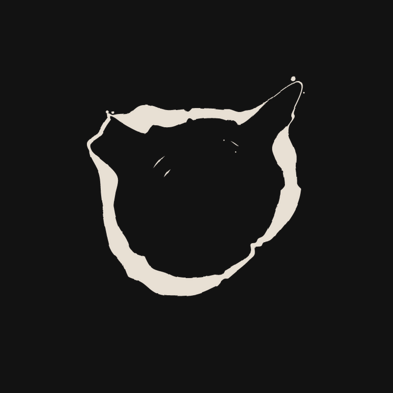

# Torus

A circular logographic writing system inspired by the heptapod language in Arrival. Words become ink on a ring — no beginning, no end, no linear time.

Live at [torus.steven-geller.com](https://torus.steven-geller.com)

<p align="center">
  
  <br>
  <em>"time is a circle"</em>
</p>

## How It Works

Type English text. Torus classifies each word by linguistic category (entity, action, property, relation, particle, negation, question), assigns semantic roles, decomposes words into universal semantic primes, and renders a deterministic circular symbol where visual features encode meaning.

**Key properties:**

- **Order-independent** — "time is a circle" and "a circle is time" produce the same symbol. Input order doesn't matter; meaning does.
- **No tense** — Torus uses aspect (timeless, bounded, unbounded) instead of past/present/future.
- **Deterministic** — Same words always produce the same symbol.
- **Reversible** — Symbols can be decoded back to their source text.
- **Calligraphic** — Brush dynamics modeled on Chinese calligraphy: pressure zones (顿笔), bone structure (骨法), ink texture (墨韵), dry brush (飞白), and taper (收笔).

## Visual Encoding

Each word category produces a distinct mark on the ring:

| Category | Mark |
|----------|------|
| Entity (nouns) | Outward tendrils with branching sub-tendrils and satellite splotches |
| Action (verbs) | Stroke-width rhythmic waves |
| Property (adj/adv) | Inner ripples along the edge |
| Relation (prepositions) | Silk-thin bridges with bow |
| Particle (the, and) | Decisive notches |
| Negation (not, never) | Deep inverted voids |
| Question (?, why) | Gap in the ring |

See [LANGUAGE.md](LANGUAGE.md) for the full linguistic system.

## Architecture

```
┌──────────────────────────────────────────────────┐
│              Axum server (:3031)                 │
│                                                  │
│  POST /api/generate      → symbol geometry JSON  │
│  POST /api/generate-svg  → SVG with embedded text│
│  POST /api/decode        → text from SVG upload  │
│  GET  /og/{text}         → 1200×630 OG image PNG │
│  GET  /png/{text}        → 600×600 download PNG  │
│  GET  /                  → frontend              │
└──────────────────────────────────────────────────┘
```

### Source Modules

| File | Lines | Purpose |
|------|-------|---------|
| `src/main.rs` | 650 | Web server, API endpoints, OG image rendering (resvg), access logging |
| `src/symbol.rs` | 768 | Symbol generation engine: polar geometry, brush dynamics, mark rendering |
| `src/language.rs` | 944 | Linguistic engine: word classification, aspect detection, semantic roles, NSM primes |
| `src/decode.rs` | 618 | Symbol recognition: metadata extraction, fingerprint matching, geometric reverse-engineering |
| `src/word_primes.rs` | 968 | Semantic prime decomposition database (500+ words) |

### Symbol Generation Pipeline

1. **Classify** — Each word gets a category (entity/action/property/...) and semantic role (agent/patient/modifier)
2. **Sort** — Words sorted by role priority + content hash (guarantees order independence)
3. **Brush pressure** — 2–3 Gaussian pressure zones placed on the ring
4. **Bone structure** — Sinusoidal radius modulation creates the ring's overall shape
5. **Word marks** — Category-specific geometry placed at each word's angular position
6. **Ink texture** — Fractional Brownian motion noise for organic variation
7. **Dry brush** — Stochastic stroke gaps at 12–30% intensity
8. **Taper** — Automatic width reduction at stroke extremes
9. **Embellishments** — Accent dots, wisps, inner arcs, branching structures
10. **SVG render** — Polar → Cartesian conversion, dual-path ring (fill-rule evenodd)

### Decoding Pipeline

Symbols can be decoded back to text through four methods (tried in order):

1. **Embedded metadata** — SVGs from the generate endpoint carry base64-encoded source text
2. **Fingerprint lookup** — Visual fingerprint matched against known symbols database
3. **Dictionary match** — Pre-computed fingerprints for all dictionary words
4. **Geometric analysis** — Detect marks from path geometry, classify by shape, search candidate word combinations

## Setup

### Prerequisites

- Rust 1.75+

### Build and Run

```bash
cargo build --release
./target/release/torus
```

Server starts on `127.0.0.1:3031`. For production, put it behind a reverse proxy with TLS.

### systemd (production)

```ini
[Unit]
Description=Torus logographic language
After=network.target

[Service]
Type=simple
WorkingDirectory=/home/user/torus
ExecStart=/home/user/torus/target/release/torus
Restart=on-failure

[Install]
WantedBy=multi-user.target
```

## API

### Generate Symbol

```bash
curl -X POST https://torus.steven-geller.com/api/generate \
  -H 'Content-Type: application/json' \
  -d '{"text": "time is a circle"}'
```

Returns JSON with word analysis, semantic primes, and ring geometry (outer/inner point arrays).

### Generate SVG

```bash
curl -X POST https://torus.steven-geller.com/api/generate-svg \
  -H 'Content-Type: application/json' \
  -d '{"text": "time is a circle"}'
```

Returns an SVG string with the source text base64-encoded in a `data-torus-text` attribute.

### Decode Symbol

```bash
curl -X POST https://torus.steven-geller.com/api/decode \
  -F 'file=@symbol.svg'
```

Returns JSON with decoded text, confidence level, and method used.

### Download PNG

```bash
curl -O https://torus.steven-geller.com/png/time%20is%20a%20circle
```

Returns a 600×600 PNG on dark background.

## Frontend Features

- Real-time symbol generation with morphing animation between states
- Word mark labels positioned near their marks with linguistic metadata
- Semantic prime decomposition displayed for each word
- SVG and PNG download
- SVG upload for decoding
- Shuffle button to demonstrate order independence
- Arrival-inspired ambient sound (spacebar or on generate)
- Dark/light mode

## License

[MIT](LICENSE)
